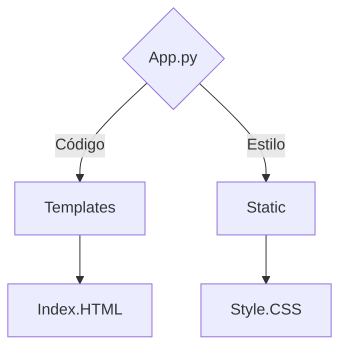

<h1 align="center">Gerador de QrCode</h1>			
<br>
<h4 align="center"> 💻 concluído (projeto base) 💻 </h4>
<h3 align="center">Gerador de QrCode para Wi-Fi</h3>

Tabela de conteúdos
=================
<!--ts-->
   * [Sobre o projeto](#-sobre-o-projeto)
     * [Problemas-resolvidos](#-problemas-resolvidos)
   * [Layout](#-layout)
   * [Como executar o projeto](#-como-executar-o-projeto)
     * [Pré-requisitos](#pré-requisitos)
     * [Funcionalidades](#funcionalidades)
   * [Tecnologias](#-tecnologias)
   * [Autor](#-autor)
   * [Licença](#-licença)
<!--te-->
## 💻 Sobre o projeto 

Descrição:
Facilite o acesso a sua rede Wi-Fi em sua residencia ou comercial, transforme os dados de login do Wi-Fi em um QrCode, evitando que haja vazamento da informação e melhore a velocidade/praticidade de login dos seus usuarios.

O Projeto inicial foi plenejado para um gerador de QrCode especificamente para Wi-Fi porem a pretenção é expandir para geração de QrCode de outras plataformas.

Tecnologias Utilizadas:
Frontend: HTML+CSS
Backend: Python
  Bibliotecas: flask, IO e wifi_qrcode_generator
 #### Escopo do projeto

---

## 🚧 Problemas resolvidos

```bash
#### 1. 📉 Vazamento de informações
  Antes: O Login no Wi-Fi só era possivel informando a senha e SSID.
  Com o QrCode: Basta o usuario scanear que logará automaticamente.
  🔺 Melhoria estimada: Redução em 95% a transmissão das informações de login para pessoas não autorizadas.
```
```bash
#### 2. 📞 Facilidade no processo
  Antes: Dependente da comunicação entre usuario e responsavel pela rede.
  Com o QrCode: Autonomia para o usuario logar sem precisar do acompanhamento do responsavel.
  🔺 Melhoria estimada: 100% de autonomia ao usuario final.
```

## 🎨Layout

-
<p align="center" style="display: flex; align-items: flex-start; justify-content: center;">
 </p>

- 

Componentes Principais:
App.py: Criará um servidor local.
index.html: Pagina inicial do site
style.css: Personalização da pagina inicial

---

## 🚀 Como executar o projeto

### Pré-requisitos

- Python instalado
  - Bibliotecas: flask, IO e wifi_qrcode_generator
- Visual Studio Code

---
  
<b>Instalação:</b>

- Baixe os arquivos deste projeto
- Abra a pasta através do Visual Studio Code
- Inicie o codigo app.py
- No seu navegador acesse o link do servidor criado: http://127.0.0.1:5000

#### Funcionalidades


## 🦸🏻‍♂️ Autor

 <br>
  <sub><b><p>Christopher Silva</p></b></sub></a>
 <br />

[](https://www.linkedin.com/in/chris-f-silva/) 
[](mailto:chrisspfc.silva@gmail.com)

---

## 📝 Licença

Este projeto está licenciado sob a licença MIT - veja o arquivo LICENSE para mais detalhes. [MIT](./LICENSE)

Feito por: Christopher Silva
</div>
